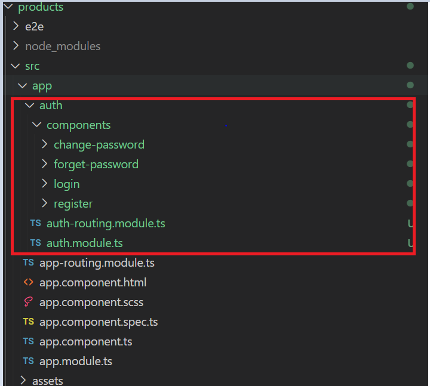
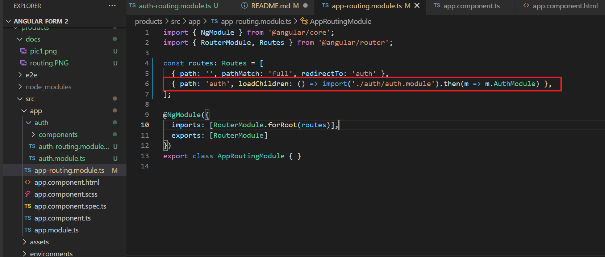

# Products

This project was generated with [Angular CLI](https://github.com/angular/angular-cli) version 11.2.10.

Step 1:

npm install -g @angular/cli

## Development server

Run `ng serve` for a dev server. Navigate to `http://localhost:4200/`. The app will automatically reload if you change any of the source files.

## Code scaffolding

Run `ng generate component component-name` to generate a new component. You can also use `ng generate directive|pipe|service|class|guard|interface|enum|module`.

## Build

Run `ng build` to build the project. The build artifacts will be stored in the `dist/` directory. Use the `--prod` flag for a production build.

Step 2:

Create Folder and run

ng new app_name (app_name can be anything)

Step 3:
    Create new auth module

    ng g module auth --routing 

Create folder inside app 
1. auth/components
2. create 3 component

ng generate component auth/components/register

ng generate component auth/components/login

ng generate component auth/components/forget-password

Update routing in auth-routing.module.ts

Step:

    update app routing module 
    here lazy load the auth routing module

Step:

    Install 
    npm i @angular/flex-layout @angular/cdk

    ng add @angular/material

Step:

    Create shared module 

    ng g m shared

    include 

    FlexLayoutModule,
    MaterialModule,
    ReactiveFormsModule,
    HttpClientModule,

    Create material module

    ng g m shared/material --flat

    import all the required angular material module

    Generate Service without spec.ts file 
         ng g s auth/services/utils/helper --skip-tests=true

INSTALL:
    npm install --save @auth0/angular-jwt

#### Login Component

#### Design HTML

